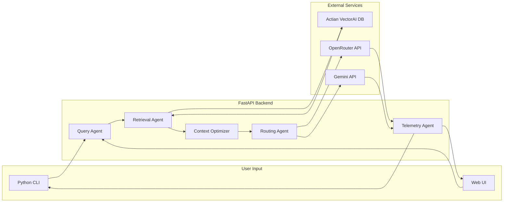

# TokenSense Hackathon Build Plan

## Project Overview

TokenSense is a developer-first AI orchestration engine that optimizes context retrieval, prompt construction, and model routing before sending requests to LLMs.




---

## Tech Stack Summary


| Layer            | Technology             | Purpose                                     |
| ---------------- | ---------------------- | ------------------------------------------- |
| Frontend         | Next.js 14 + React 18  | Web demo, dashboard, playground             |
| Backend          | FastAPI + Python 3.11+ | Async API server                            |
| CLI              | Typer                  | Developer command-line interface            |
| Vector DB        | Actian VectorAI DB     | Semantic retrieval                          |
| Model Routing    | OpenRouter API         | Multi-model abstraction                     |
| Fallback LLM     | Gemini API             | Advanced reasoning                          |
| Auth             | API Key Middleware     | Lightweight endpoint protection             |
| Caching          | In-memory + SQLite     | Query cache + telemetry storage             |
| Hosting (local)  | Shell scripts          | uvicorn + next dev via dev.sh               |
| Hosting (prod)   | Vultr Cloud Compute    | Docker Compose on Optimized VPS             |
| Reverse Proxy    | Caddy                  | Automatic HTTPS + routing on Vultr          |
| Containerization | Docker + Compose       | Orchestrates all services for deployment    |
| Package Dist     | PyPI (pip)             | `pip install tokensense` for CLI            |
| Vector DB Infra  | Docker (Actian only)   | Actian VectorAI DB runs in Docker container |


---

## Phase 1: Environment Setup

### Backend Setup Steps

1. Create Python virtual environment: `python -m venv venv && source venv/bin/activate`
2. Install core dependencies: FastAPI, uvicorn, typer, httpx, python-dotenv
3. Set up environment variables for API keys (OpenRouter, Gemini, Actian, TOKENSENSE_API_KEY)
4. Create project structure with agents, routers, and utils directories

### Frontend Setup Steps

1. Initialize Next.js project: `npx create-next-app@latest frontend --typescript --tailwind --app`
2. Install UI dependencies: shadcn/ui, recharts (for analytics), lucide-react (icons)
3. Set up API client for backend communication
4. Configure environment variables for API endpoint

---

## Phase 2: Backend Development

### Authentication

Simple API key middleware (`utils/auth.py`):

- All `/index`, `/ask`, `/optimize`, `/stats` endpoints require `X-API-Key` header
- Key is validated against `TOKENSENSE_API_KEY` in `.env`
- FastAPI dependency injection -- a single `verify_api_key` function used across all routes
- Frontend stores the key in `.env.local` and sends it with every request
- CLI reads the key from `~/.tokensense/config` or `TOKENSENSE_API_KEY` env var

### API Endpoints to Implement

- `POST /index` - Index repository for semantic search (protected)
- `POST /ask` - Query with context optimization (protected)
- `POST /optimize` - Optimize context without LLM call (protected)
- `GET /stats` - Retrieve telemetry data (protected)

### Caching Strategy

- **In-memory** (`functools.lru_cache`) for embedding and query result caching -- zero setup, fast
- **SQLite** (`utils/db.py`) for telemetry persistence -- token counts, costs, latency logs survive restarts
- No Redis or external cache services needed

### Agent Modules to Build

1. **Query Agent** (`agents/query_agent.py`) - Embedding generation, task classification
2. **Retrieval Agent** (`agents/retrieval_agent.py`) - VectorAI DB communication, top-k fetch
3. **Context Optimizer** (`agents/context_optimizer.py`) - Deduplication, compression
4. **Routing Agent** (`agents/routing_agent.py`) - Model selection logic
5. **Telemetry Agent** (`agents/telemetry_agent.py`) - Cost/token tracking

### CLI Commands

- `tokensense init` - Initialize project
- `tokensense index ./repo` - Index codebase
- `tokensense ask "query"` - Query with optimization
- `tokensense stats` - Show analytics

---

## Phase 3: Frontend Development

### Pages to Build

1. **Landing Page** (`/`) - Problem statement, architecture diagram, CTA
2. **Playground** (`/playground`) - Before/after token comparison demo
3. **Dashboard** (`/dashboard`) - Analytics visualization
4. **Docs** (`/docs`) - Developer documentation

### Key Components

- Token comparison visualizer
- Cost savings calculator
- Latency charts (using Recharts)
- Code input/output panels

---

## Phase 4: Integration & Testing

1. Connect frontend to backend API
2. Test full flow: index → ask → display results
3. Verify telemetry data collection
4. Test model routing logic

---

## Phase 5: Local Development Environment

### Prerequisites (Docker required only for Actian VectorAI DB)

1. Install Docker Desktop -- needed solely to run Actian VectorAI DB container
2. Pull and run the Actian VectorAI DB image (document the exact `docker run` command)
3. Verify the vector DB is accessible on its local port before starting the app

### Running the App (no Docker needed)

1. `dev.sh` script starts both services:
  - Backend: `uvicorn backend.main:app --reload --port 8000`
  - Frontend: `cd frontend && npm run dev` (runs on `http://localhost:3000`)
2. Configure CORS in FastAPI to allow `http://localhost:3000`
3. All environment variables loaded from `.env` at project root
4. Document full local setup steps in README.md

---

## Phase 6: Vultr Cloud Deployment

Deploy the full TokenSense stack to Vultr Cloud so users can `pip install tokensense` and connect to a hosted API — no local Docker, no cloning, no backend setup on their end.

### Why Vultr

Vultr is a hackathon track sponsor. TokenSense uses Vultr Optimized Cloud Compute to host the entire production infrastructure — backend API, vector database, and web dashboard — behind HTTPS with automatic TLS certificates.

### Architecture on Vultr

```
User's Machine                           Vultr Cloud Compute
─────────────                           ────────────────────
                                      ┌───────────────────────────┐
pip install tokensense                │  Ubuntu 22.04 VPS         │
     │                                │                           │
     │  tokensense init --demo        │  ┌───────────────────┐   │
     │  tokensense index              │  │ Caddy (HTTPS)     │   │
     │  tokensense ask  ──────────────┼──│  :443 → :8000     │   │
     │                                │  │  :443 → :3000     │   │
     │  Browser ──────────────────────┼──│                    │   │
     │                                │  └───────┬───────────┘   │
                                      │          │               │
                                      │  ┌───────▼───────────┐   │
                                      │  │ FastAPI Backend    │   │
                                      │  │  :8000 (internal)  │   │
                                      │  └───────┬───────────┘   │
                                      │          │               │
                                      │  ┌───────▼───────────┐   │
                                      │  │ Actian VectorAI DB │   │
                                      │  │  :50051 (internal) │   │
                                      │  └───────────────────┘   │
                                      │                           │
                                      │  ┌───────────────────┐   │
                                      │  │ Next.js Frontend   │   │
                                      │  │  :3000 (internal)  │   │
                                      │  └───────────────────┘   │
                                      │                           │
                                      └───────────────────────────┘
```

### Vultr Deployment Steps


| #   | Task                        | Description                                                              | Time   |
| --- | --------------------------- | ------------------------------------------------------------------------ | ------ |
| 6.1 | Create `backend/Dockerfile` | Containerize FastAPI + Actian client                                     | 10 min |
| 6.2 | Create `deploy/Caddyfile`   | HTTPS reverse proxy for api + frontend subdomains                        | 5 min  |
| 6.3 | Create `docker-compose.yml` | Orchestrate Actian + backend + frontend + Caddy                          | 15 min |
| 6.4 | Provision Vultr instance    | Optimized Cloud Compute, Ubuntu 22.04, $12/mo                            | 10 min |
| 6.5 | Server setup                | SSH in, install Docker, clone repo, configure `.env`                     | 15 min |
| 6.6 | Configure domain DNS        | Point `api.tokensense.dev` + `tokensense.dev` to Vultr IP                | 10 min |
| 6.7 | Configure Vultr Firewall    | Only ports 22/80/443 open, Actian + backend internal only                | 5 min  |
| 6.8 | Add CLI `--demo` flag       | `tokensense init --demo` auto-sets hosted API URL                        | 5 min  |
| 6.9 | End-to-end verification     | Test `pip install tokensense` → init → index → ask from external machine | 10 min |


### Vultr Services Used


| Vultr Service               | Purpose in TokenSense                                           |
| --------------------------- | --------------------------------------------------------------- |
| **Optimized Cloud Compute** | Hosts all containers (backend, Actian DB, frontend, Caddy)      |
| **Vultr Firewall**          | Secures infrastructure — only HTTPS exposed, vector DB internal |
| **Vultr DNS** (optional)    | Manage domain records for `tokensense.dev`                      |


### Docker Compose Services


| Service    | Image                            | Ports            | Notes                          |
| ---------- | -------------------------------- | ---------------- | ------------------------------ |
| `actian`   | `actian/vectorai-db`             | 50051 (internal) | Vector database, never exposed |
| `backend`  | Built from `backend/Dockerfile`  | 8000 (internal)  | FastAPI, depends on actian     |
| `frontend` | Built from `frontend/Dockerfile` | 3000 (internal)  | Next.js, depends on backend    |
| `caddy`    | `caddy:2-alpine`                 | 80, 443 (public) | Reverse proxy, auto HTTPS      |


### Vultr Firewall Rules


| Port  | Source       | Purpose                          |
| ----- | ------------ | -------------------------------- |
| 22    | Your IP only | SSH access                       |
| 80    | Anywhere     | HTTP → Caddy redirects to HTTPS  |
| 443   | Anywhere     | HTTPS (public API + frontend)    |
| 50051 | Drop         | Actian DB never exposed          |
| 8000  | Drop         | Backend only reachable via Caddy |


### User Experience After Vultr Deployment

```bash
pip install tokensense
tokensense init --demo
# API key: <key>
tokensense index ./my-project
tokensense ask "explain the auth flow"
tokensense stats
```

No Docker, no cloning, no `.env` file, no backend setup. Just `pip install` and go.

### Vultr Deployment Checklist

```
[ ] backend/Dockerfile created
[ ] deploy/Caddyfile created
[ ] docker-compose.yml created
[ ] Vultr Optimized Cloud Compute instance provisioned
[ ] Server setup — Docker installed, repo cloned, .env configured
[ ] docker compose up -d running all 4 services
[ ] Domain DNS records pointing to Vultr IP
[ ] Vultr Firewall rules configured
[ ] CLI --demo flag added
[ ] End-to-end test from external machine passes
```

> **Full Vultr deployment details:** See `docs/BACKEND_PLAN.md` → Phase 6 for step-by-step implementation instructions including Dockerfile contents, Caddyfile config, docker-compose.yml, and server setup script.

---

## Files to Create

### Planning Documentation

- `docs/BACKEND_PLAN.md` - Detailed backend specifications
- `docs/FRONTEND_PLAN.md` - Detailed frontend specifications

### Project Structure

```
TokenSense/
├── backend/
│   ├── agents/
│   ├── routers/
│   ├── utils/          # includes auth.py for API key middleware
│   ├── main.py
│   ├── Dockerfile       # containerizes backend for Vultr deployment
│   └── requirements.txt
├── frontend/
│   ├── app/
│   ├── components/
│   ├── Dockerfile       # containerizes frontend for Vultr deployment
│   └── package.json
├── cli/
│   └── tokensense.py
├── tokensense/           # pip-installable package
│   ├── __init__.py
│   └── cli.py
├── deploy/
│   ├── Caddyfile         # HTTPS reverse proxy for Vultr
│   └── setup-vultr.sh    # one-command Vultr server provisioning
├── docs/
│   ├── BACKEND_PLAN.md
│   ├── FRONTEND_PLAN.md
│   └── USER_GUIDE.md
├── tests/
│   ├── test_actian_direct.py
│   └── test_actian_via_api.py
├── docker-compose.yml    # orchestrates all services for Vultr
├── pyproject.toml        # pip package config
├── dev.sh                # starts backend + frontend locally
├── .env.example          # template for environment variables
├── LICENSE
└── README.md
```

