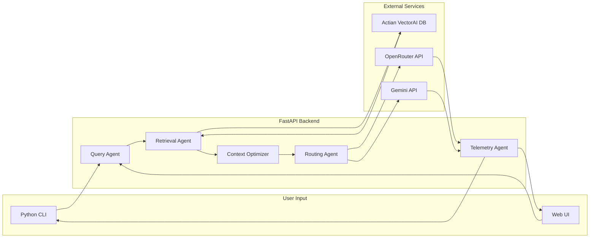

# TokenSense Hackathon Build Plan

## Project Overview

TokenSense is a developer-first AI orchestration engine that optimizes context retrieval, prompt construction, and model routing before sending requests to LLMs.




---

## Tech Stack Summary


| Layer           | Technology             | Purpose                                     |
| --------------- | ---------------------- | ------------------------------------------- |
| Frontend        | Next.js 14 + React 18  | Web demo, dashboard, playground             |
| Backend         | FastAPI + Python 3.11+ | Async API server                            |
| CLI             | Typer                  | Developer command-line interface            |
| Vector DB       | Actian VectorAI DB     | Semantic retrieval                          |
| Model Routing   | OpenRouter API         | Multi-model abstraction                     |
| Fallback LLM    | Gemini API             | Advanced reasoning                          |
| Auth            | API Key Middleware     | Lightweight endpoint protection             |
| Caching         | In-memory + SQLite     | Query cache + telemetry storage             |
| Hosting         | Local (scripts)        | uvicorn + next dev via shell scripts        |
| Vector DB Infra | Docker (Actian only)   | Actian VectorAI DB runs in Docker container |


---

## Phase 1: Environment Setup

### Backend Setup Steps

1. Create Python virtual environment: `python -m venv venv && source venv/bin/activate`
2. Install core dependencies: FastAPI, uvicorn, typer, httpx, python-dotenv
3. Set up environment variables for API keys (OpenRouter, Gemini, Actian, TOKENSENSE_API_KEY)
4. Create project structure with agents, routers, and utils directories

### Frontend Setup Steps

1. Initialize Next.js project: `npx create-next-app@latest frontend --typescript --tailwind --app`
2. Install UI dependencies: shadcn/ui, recharts (for analytics), lucide-react (icons)
3. Set up API client for backend communication
4. Configure environment variables for API endpoint

---

## Phase 2: Backend Development

### Authentication

Simple API key middleware (`utils/auth.py`):

- All `/index`, `/ask`, `/optimize`, `/stats` endpoints require `X-API-Key` header
- Key is validated against `TOKENSENSE_API_KEY` in `.env`
- FastAPI dependency injection -- a single `verify_api_key` function used across all routes
- Frontend stores the key in `.env.local` and sends it with every request
- CLI reads the key from `~/.tokensense/config` or `TOKENSENSE_API_KEY` env var

### API Endpoints to Implement

- `POST /index` - Index repository for semantic search (protected)
- `POST /ask` - Query with context optimization (protected)
- `POST /optimize` - Optimize context without LLM call (protected)
- `GET /stats` - Retrieve telemetry data (protected)

### Caching Strategy

- **In-memory** (`functools.lru_cache`) for embedding and query result caching -- zero setup, fast
- **SQLite** (`utils/db.py`) for telemetry persistence -- token counts, costs, latency logs survive restarts
- No Redis or external cache services needed

### Agent Modules to Build

1. **Query Agent** (`agents/query_agent.py`) - Embedding generation, task classification
2. **Retrieval Agent** (`agents/retrieval_agent.py`) - VectorAI DB communication, top-k fetch
3. **Context Optimizer** (`agents/context_optimizer.py`) - Deduplication, compression
4. **Routing Agent** (`agents/routing_agent.py`) - Model selection logic
5. **Telemetry Agent** (`agents/telemetry_agent.py`) - Cost/token tracking

### CLI Commands

- `tokensense init` - Initialize project
- `tokensense index ./repo` - Index codebase
- `tokensense ask "query"` - Query with optimization
- `tokensense stats` - Show analytics

---

## Phase 3: Frontend Development

### Pages to Build

1. **Landing Page** (`/`) - Problem statement, architecture diagram, CTA
2. **Playground** (`/playground`) - Before/after token comparison demo
3. **Dashboard** (`/dashboard`) - Analytics visualization
4. **Docs** (`/docs`) - Developer documentation

### Key Components

- Token comparison visualizer
- Cost savings calculator
- Latency charts (using Recharts)
- Code input/output panels

---

## Phase 4: Integration & Testing

1. Connect frontend to backend API
2. Test full flow: index → ask → display results
3. Verify telemetry data collection
4. Test model routing logic

---

## Phase 5: Local Development Environment

### Prerequisites (Docker required only for Actian VectorAI DB)

1. Install Docker Desktop -- needed solely to run Actian VectorAI DB container
2. Pull and run the Actian VectorAI DB image (document the exact `docker run` command)
3. Verify the vector DB is accessible on its local port before starting the app

### Running the App (no Docker needed)

1. `dev.sh` script starts both services:
  - Backend: `uvicorn backend.main:app --reload --port 8000`
  - Frontend: `cd frontend && npm run dev` (runs on `http://localhost:3000`)
2. Configure CORS in FastAPI to allow `http://localhost:3000`
3. All environment variables loaded from `.env` at project root
4. Document full local setup steps in README.md

---

## Files to Create

### Planning Documentation

- `docs/BACKEND_PLAN.md` - Detailed backend specifications
- `docs/FRONTEND_PLAN.md` - Detailed frontend specifications

### Project Structure

```
TokenSense/
├── backend/
│   ├── agents/
│   ├── routers/
│   ├── utils/          # includes auth.py for API key middleware
│   ├── main.py
│   └── requirements.txt
├── frontend/
│   ├── app/
│   ├── components/
│   └── package.json
├── cli/
│   └── tokensense.py
├── docs/
│   ├── BACKEND_PLAN.md
│   └── FRONTEND_PLAN.md
├── dev.sh                # starts backend + frontend locally
├── .env.example          # template for environment variables
└── README.md
```

