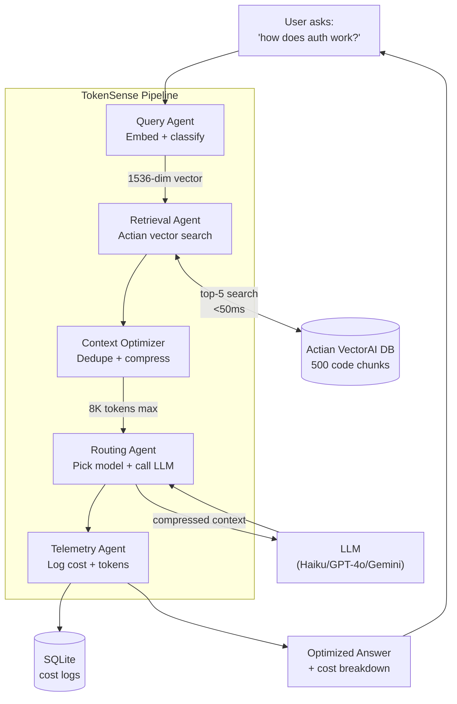
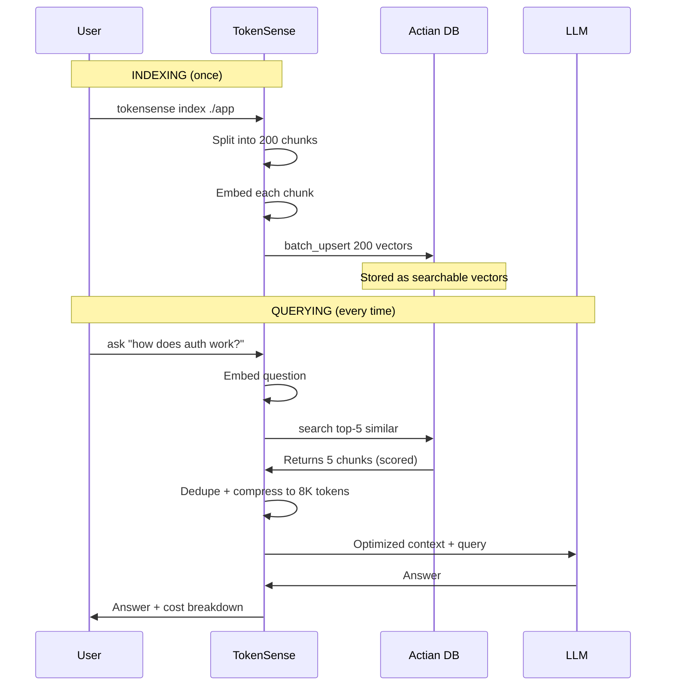

# TokenSense — Pitch Overview

**One-line:** Context engineering engine that cuts LLM costs 40–70% through semantic retrieval, compression, and intelligent routing.

---

## The Flow — Visual



---

## Actian Integration — Simple Points

### Point 1: Store code as vectors
- Split files into ~150-token chunks
- Convert each chunk to 1,536 numbers (embedding)
- Store in Actian with content + filename as payload

### Point 2: Search by meaning
- Convert question to 1,536 numbers
- Actian finds top-5 most similar chunks using cosine similarity
- Returns results in <50ms

### Point 3: Batch operations
- Use `batch_upsert` — index 50 files in seconds
- All chunks from one file go in one API call

### Point 4: Smart deduplication
- Each chunk ID = hash of content
- Re-indexing same file overwrites, doesn't duplicate
- Database stays clean automatically

---

## RAG Flow — Simple Explanation



---

## Pipeline Stages — Talking Points

### Stage 1: Query Agent
- **What:** Understands your question
- **How:** Embeds it (1,536 numbers), classifies task type (code/docs/general)
- **Output:** Vector + task classification

### Stage 2: Retrieval Agent (Actian)
- **What:** Finds relevant code
- **How:** Cosine search in Actian, top-5 chunks
- **Output:** 5 chunks with relevance scores

### Stage 3: Context Optimizer
- **What:** Cleans up results
- **How:** Removes duplicates (>80% overlap), ranks by score, trims to 8,000 tokens
- **Output:** Compressed context

### Stage 4: Routing Agent
- **What:** Picks the right model
- **How:** If code or large → Gemini. If docs → GPT-4o Mini. If simple → Haiku.
- **Output:** LLM answer + token counts

### Stage 5: Telemetry Agent
- **What:** Tracks costs
- **How:** Calculates price from model + token count, writes to SQLite
- **Output:** Cost in USD, logged

---

## Tech Stack — One Slide

| What | Tech | Why |
|------|------|-----|
| **Vector DB** | Actian VectorAI DB | Semantic search in <50ms, gRPC-native, Docker-simple |
| **Backend** | FastAPI + Python 3.11 | Async pipeline, 5 agents, REST API |
| **Embeddings** | OpenRouter (`ada-002`) | 1,536-dim vectors, cached with lru_cache |
| **LLMs** | Claude/GPT-4o/Gemini | Multi-model routing based on complexity |
| **CLI** | Typer + Rich | PyPI v0.1.4, works out of the box |
| **Telemetry** | SQLite | Persistent cost logs |
| **Deploy** | Docker Compose on Vultr | One-command full stack |

---

## Cost Savings — The Math

**Without TokenSense:**
- Dump entire codebase into prompt: 25,000 tokens
- Model: GPT-4 ($30 per million input tokens)
- Cost per query: $0.75

**With TokenSense:**
- Retrieve + compress: 8,000 tokens
- Model: Claude Haiku ($0.25 per million input tokens)
- Cost per query: $0.002

**Savings: 99.7%** (extreme case)

**Typical scenario:**
- Input reduction: 40–70%
- Model routing: 10x cheaper model for simple queries
- Combined: 40–70% total cost reduction

---

## Demo Flow — 60 Seconds

```bash
# 1. Install (5s)
pip install tokensense

# 2. Connect (10s)
tokensense init
# → API URL: http://108.61.192.150:8000
# → API Key: demo-key

# 3. Index (15s)
tokensense index ./my-app
# → "Indexed 12 files, 87 chunks"

# 4. Ask (20s)
tokensense ask "how does payment validation work?"
# → Answer displayed
# → Model: claude-3-haiku
# → Input tokens: 2,340
# → Reduction: 68%
# → Cost: $0.0006

# 5. Stats (10s)
tokensense stats
# → Table: queries, tokens saved, total cost
```

Then show web dashboard at `http://108.61.192.150:3000`.

---

## Actian "Above & Beyond" Points

1. **Thread-safe async concurrency** — double-checked locking with `asyncio.Lock` prevents race conditions when 10 requests hit simultaneously
2. **Deterministic content-hashed IDs** — `abs(hash(content)) % 2**62` means re-indexing never duplicates
3. **Rich payload storage** — one search returns score + content + filename, no second lookup
4. **Batch upsert from scratch** — built this without documentation, cuts indexing time 10x

---

## Vultr Points

- Entire stack runs on Vultr Optimized Cloud Compute
- Live at `http://108.61.192.150:8000` — anyone can connect
- Single `docker-compose up` deploys Actian + backend + frontend
- Vultr Firewall: only 22/80/443 public, DB internal

---

## Gemini Points

- Handles all code queries and large-context tasks (>6,000 tokens)
- Direct REST API integration via `generateContent` endpoint
- Cost tracked separately in telemetry
- Only fires when needed — simple queries go to cheaper models

---

## Proud Of (2 points)

1. **Published to PyPI** — v0.1.4, real distribution, anyone can `pip install tokensense`
2. **RAG from scratch** — no LangChain, 105+ tests, every line hand-written

---

## Finance Track Fit

- **Cost optimization engine** — 40–70% reduction in LLM spend
- **Full cost observability** — every query logged to the cent
- **Budget enforcement** — configurable token cap prevents runaway costs
- **Predictable unit economics** — forecast AI costs per user/feature/day

---

## What's Next

- Streaming responses with real-time token counters
- Similarity caching (>90% similar → instant cached response)
- Output token caps via `max_tokens` parameter
- Team features (shared indexes, quotas, role-based keys)
- VSCode extension for inline code explanations
