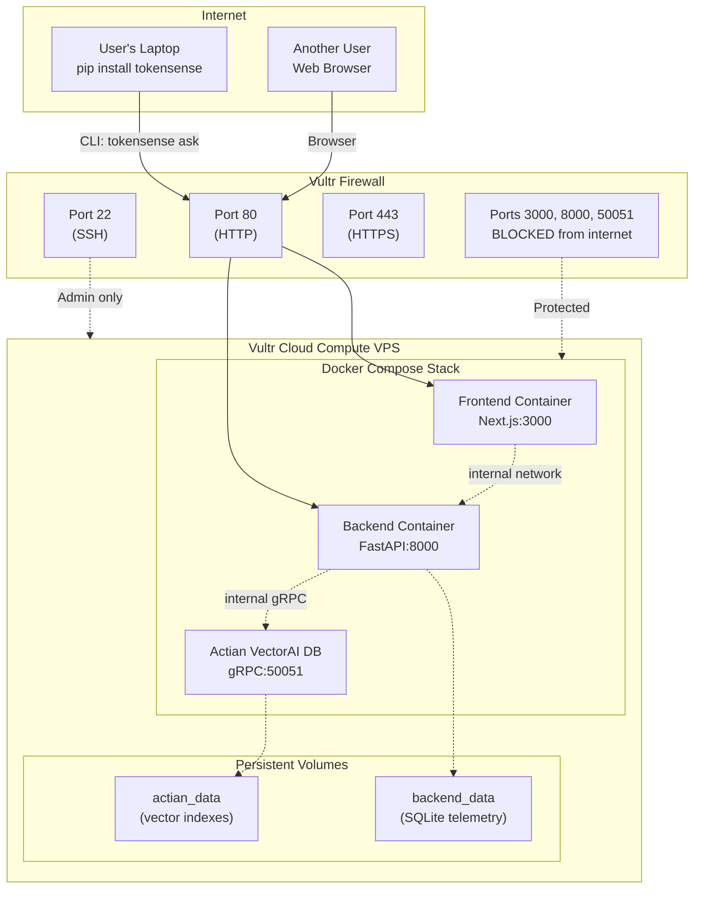
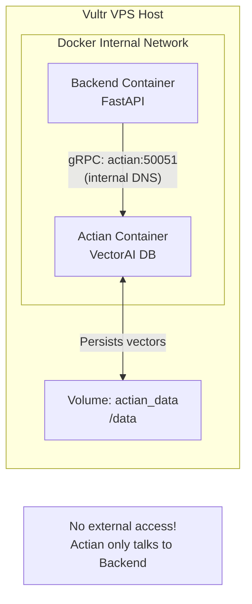
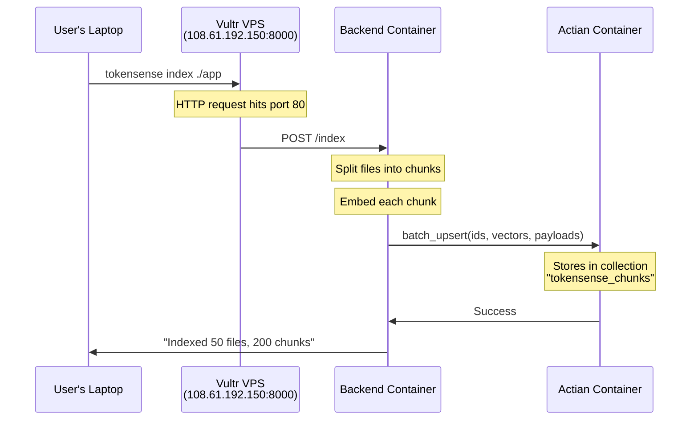
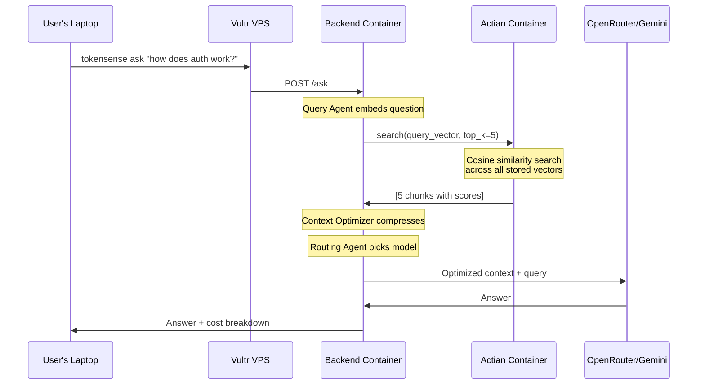

# Vultr + Actian Architecture

How Vultr Cloud Compute and Actian VectorAI DB work together in TokenSense.

---

## Deployment Architecture



**Key insight:** Only HTTP/HTTPS are public. Actian and the backend communicate on Docker's internal network — completely isolated from the internet.

---

## How Actian Works Inside the Stack



**Environment variable in backend:**
```bash
ACTIAN_HOST=actian  # Docker Compose service name
ACTIAN_PORT=50051   # Internal port
```

**Why this matters:** Actian doesn't need authentication or encryption because it never touches the public internet. It's completely protected by Vultr's firewall.

---

## Data Flow: Indexing



**Actian's job:** Store 1,536-dimensional vectors with content and source file as payload. All communication happens inside Docker's private network.

---

## Data Flow: Querying



**Actian's job:** Semantic search in <50ms. Returns scored, ranked chunks with full payloads.

---

## Why Vultr + Actian is Perfect Together

| Challenge | Vultr Solution | Actian Solution |
|-----------|----------------|-----------------|
| **Hosting complexity** | One VPS runs everything via Docker Compose | Actian runs as a simple container, no cluster setup |
| **Network security** | Vultr Firewall blocks DB ports from internet | Actian uses internal Docker DNS, no auth needed |
| **Persistence** | Vultr VPS with persistent disk | Named Docker volume survives restarts |
| **Performance** | Low-latency VPS with SSD storage | gRPC protocol, <50ms search times |
| **Developer experience** | Single IP for all services | Zero config — `ACTIAN_HOST=actian` just works |

---

## Docker Compose Configuration

```yaml
services:
  actian:
    image: williamimoh/actian-vectorai-db:1.0b
    ports:
      - "50051"  # Internal only, NOT exposed to host
    volumes:
      - actian_data:/data
    restart: unless-stopped

  backend:
    build: ./backend
    environment:
      - ACTIAN_HOST=actian      # Docker service name
      - ACTIAN_PORT=50051       # Internal port
    depends_on:
      - actian
    ports:
      - "8000:8000"             # Exposed to host
    volumes:
      - backend_data:/app/data
    restart: unless-stopped

volumes:
  actian_data:
  backend_data:
```

**Key detail:** `ports: - "50051"` without a host mapping means the port is only available inside Docker's network. The backend connects via `actian:50051` using Docker's internal DNS.

---

## One-Command Deployment

On the Vultr VPS:

```bash
# 1. Clone repo
git clone https://github.com/yourusername/TokenSense.git
cd TokenSense

# 2. Configure environment
cp .env.example .env
nano .env  # Add API keys

# 3. Start everything
docker-compose up -d

# 4. Verify
curl http://localhost:8000/
# {"status": "ok", "service": "TokenSense"}
```

That's it. Actian + Backend + Frontend all running, all persistent, all secured by Vultr's firewall.

---

## The "Wow" Story

**For judges:**

> "The entire TokenSense stack — backend, vector database, web UI — runs on a single Vultr VPS. Actian VectorAI DB stores all the vectors, but it's completely isolated from the internet. Only the FastAPI backend can talk to it, using Docker's internal network. When a user runs `pip install tokensense`, they're connecting to this Vultr instance in real-time. No local setup. No Docker on their machine. The vector search happens server-side at 108.61.192.150, inside Actian, and the results stream back in under 50 milliseconds.
>
> This is production-ready infrastructure — persistent storage, firewall-protected, one-command deploy — all built during a hackathon."

---

## Technical Highlights

### Vultr
- **Optimized Cloud Compute** — SSD storage, low-latency network
- **Firewall** — only ports 22/80/443 exposed, database layer protected
- **Single IP** — users connect to one address for CLI, API, and web UI
- **Docker-friendly** — `docker-compose up` just works

### Actian
- **gRPC performance** — binary protocol, <50ms search times
- **No auth overhead** — runs in isolated network, doesn't need encryption
- **Persistent volumes** — vectors survive container restarts
- **Cosine similarity** — built-in, fast, production-quality

### Together
- **Zero network configuration** — Docker Compose handles DNS automatically
- **Secure by default** — Actian never exposed to public internet
- **One-command deploy** — entire stack starts with `docker-compose up -d`
- **Production-ready** — persistent storage, automatic restarts, firewall protection
